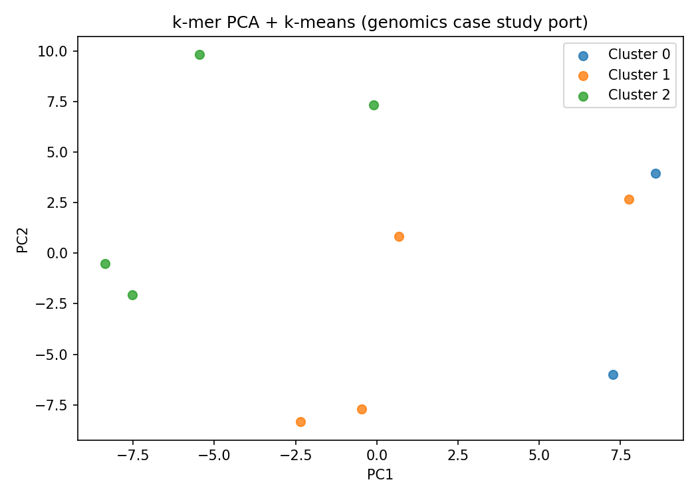
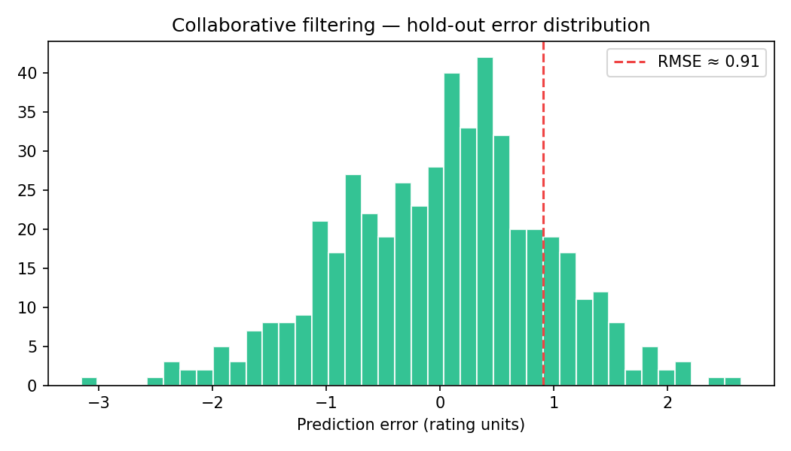

# mitx-bigdata-movielens

**MITx xPro — Data Science and Big Data Analytics**

Big Data na prática: filtragem colaborativa (MovieLens 100k) e redução de dimensionalidade com PCA/k-means no caso genômico.

---

## Análises técnicas

### PCA + k-means em k-mers (port do Case Study 1)



Port Python de `CalcFreq.m` → `PCAFreq.m` → `ClustFreq.m` (Week 1). Matriz de frequências de k-mers em fragmentos de DNA.

### Collaborative filtering — distribuição de erros



User-based CF com correlação de Pearson; métricas: **RMSE**, **MAE** em hold-out.

---

## Módulos

| Módulo | Técnica | Comando |
|--------|---------|---------|
| `movielens/` | User-based CF | `python movielens/run.py` |
| `pca_lda/` | k-mer PCA + k-means | `python pca_lda/run.py` |
| `evaluation/` | RMSE, silhouette, ARI | import |

> MovieLens: baixar dados conforme `data/README.md` (não redistribuível).

## Setup

```bash
pip install -r requirements.txt
python pca_lda/run.py
python docs/generate_figures.py
```

## Autor

**Guarantã Almeida** — [github.com/guaranta](https://github.com/guaranta)
